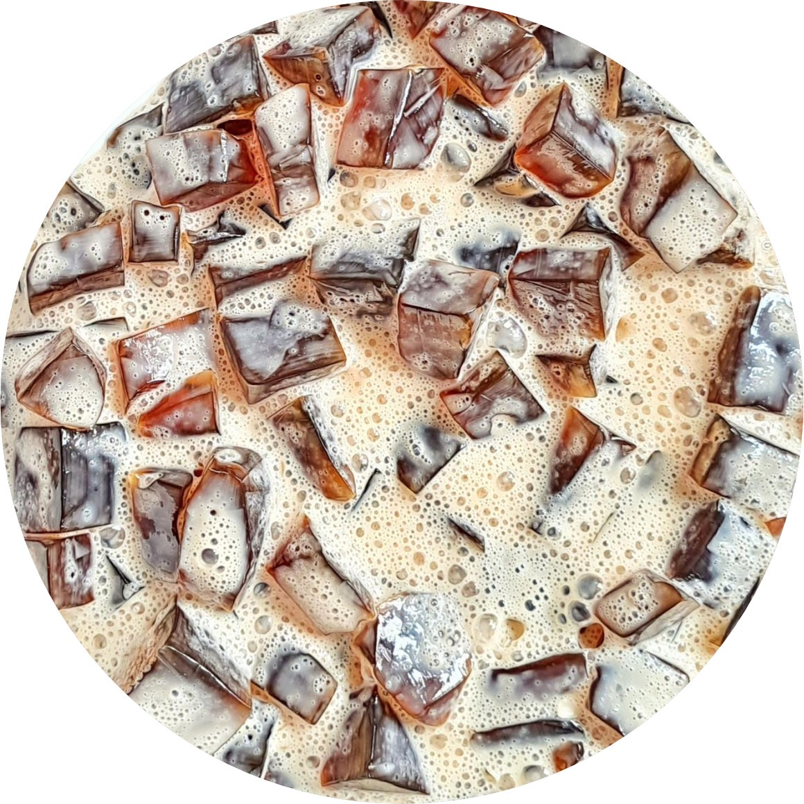

<!DOCTYPE html>
<html lang="en">
<head>
    <meta charset="UTF-8">
    <meta name="viewport" content="width=device-width, initial-scale=1.0">
    <link href="https://fonts.googleapis.com/css2?family=Trirong" rel="stylesheet">
    <link rel="stylesheet" href="https://cdnjs.cloudflare.com/ajax/libs/font-awesome/6.2.0/css/all.min.css">
    <title>Our Menu</title>
    
</head>
<body>
    <header class="header">
        
        <nav class="nav-bar">
            <a href="index.html#">Menu</a>
        </nav>
    </header>
    

        <h1>Our Menu</h1>
        

            
            
Caldereta

        

        

            
            
Coffee Jelly

        

        

            
            
Chapseuy

        

        

            
            
Menudo

        

        

            
            
Leche Flan

        

        

            
            
Pork lumpia

        

    

    <footer class="footer" id="contact">
        

            

                <h2>About Us</h2>
                
LAMSID Catering Company delivers exceptional culinary experiences, from bespoke menus to 
                    attentive event services.

                

                    <i class="fas fa-phone"></i> + (886) 987-654-321
                    <i class="fas fa-envelope"></i> <a href="mailto:abc@1234.com"> info@lamsid.com</a>
                

                

                    <a href="#"><i class="fab fa-facebook"></i></a>
                    <a href="#"><i class="fab fa-twitter"></i></a>
                    <a href="#"><i class="fab fa-instagram"></i></a>
                    <a href="#"><i class="fab fa-whatsapp"></i></a>
                

            

            

                <h2>Quick Links</h2>
                <ul>
                    <li><a href="index.html#">Home</a></li>
                    <li><a href="index.html#about">About</a></li>
                    <li><a href="menu.html">Menu</a></li>
                    <li><a href="index.html#services">Services</a></li>
                    <li><a href="contact_us.html">Contact</a></li>
                </ul>
            

            

                <h2>Contact Us</h2>
                <form id="contactForm">
                    <input type="email" name="email" id="email" class="text-input contact-input" placeholder="Your email address">
                    

                    <textarea rows="4" name="message" class="text-input contact-input" placeholder="Your message"></textarea>
                    <button type="submit" class="btn-primary">
                        <i class="fas fa-envelope"></i>
                        Send
                    </button>
                </form>
            

        

        

            &copy; 2024 LASMID. All rights reserved.
        

    </footer>
    <!-- End Footer -->
    
    
</body>
</html>
